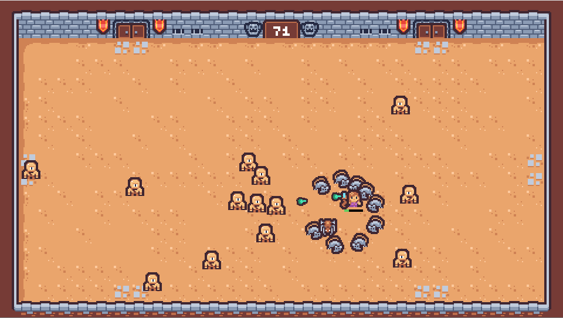

This is my interpretation of the game jam's theme, "Last Stand." Since it's my first time participating in a game jam, I've decided to keep it short and simple. Inspired by the survivor genre, I aimed for a concept that is both manageable for me and fitting to the theme.

# Credits
- Sprites: https://kenney.nl/assets/tiny-dungeon
- Font: https://fonts.google.com/specimen/Press+Start+2P
- Font: https://dursco.itch.io/3x4pixel
- Ui: https://paperhatlizard.itch.io/cryos-mini-gui

## Tutorials
- https://www.youtube.com/@Gdquest
- https://www.youtube.com/@uheartbeast
- https://www.youtube.com/@BrannoDev